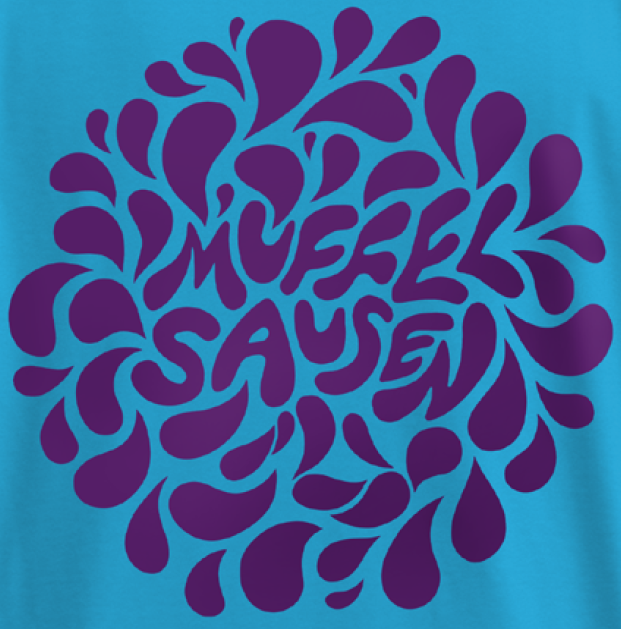

<!DOCTYPE html>
<html lang="en">
<head>
    <meta charset="UTF-8">
    <meta name="viewport" content="width=device-width, initial-scale=1.0">
    <title>Muffelsausen</title>
    <link rel="stylesheet" href="styles.css">
    
</head>
<body>
    <button class="menu-button" onclick="toggleMenu()">☰</button>
    

        <a href="main.html" onclick="toggleMenu()">Home</a>
        <a href="event.html" onclick="toggleMenu()">Events</a>
        <a href="contact.html" onclick="toggleMenu()">Contact</a>
        <a href="about.html" onclick="toggleMenu()">About</a>
    

    

        <h1>Muffelsausen</h1>
        
        
Welcome to the official Muffelsausen event page.

        
Bla Bla Bla Bla Bla Bla Bla Bla Bla Bla Bla Bla!

    

    
</body>
</html>
